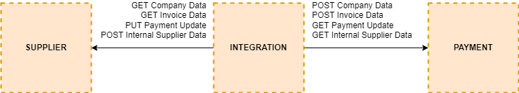
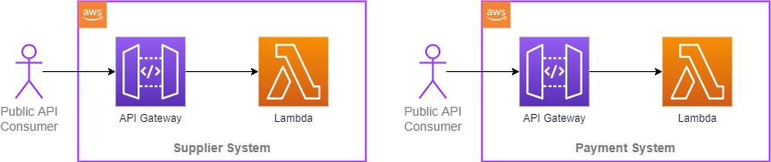
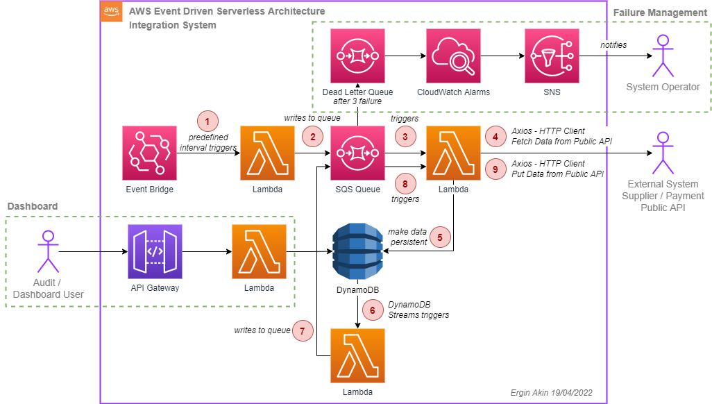

# ABC Company Integration Solution PoC

### Data flow between systems

### Payment and Supplier systems

### Integration system AWS Serverless Solution Architecture

### Quick Start

Requirements
- AWS CLI installed & configured (https://docs.aws.amazon.com/cli/latest/userguide/getting-started-install.html)
- Serverless Framework (https://www.serverless.com/framework/docs/getting-started)

First goto supplier and payment folders then goto integration folder to run commands below
`npm install`
&
`sls deploy`

